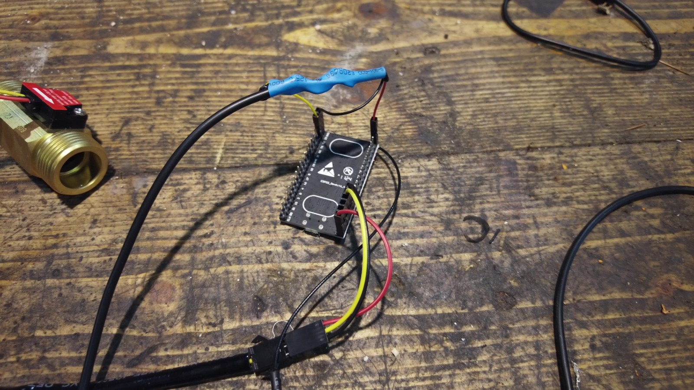

# esp-controller

Part of a larger system to automate home control using ESPHome and Home Assistant.

The goal is to use multiple ESP32s to manage every aspect of the water, heating, and electricity networks.

1. Water
   
The water grid system is fairly straightforward. All I need is a flow meter, a valve, and two thermometers at the main water inlet.

The flow meter measures consumption and detects leaks, while the thermometers monitor both ambient air temperature and water temperature to prevent freezing in the pipes. The valve is used to shut off the water supply in case of a leak or an unexpected event.

Example of the ESP setup for the water grid:

2. Heating
   
Heating is a long-term project, but the main heat source in winter is a wood-fired boiler. The boiler must operate within a specific temperature range.

At startup, when the water is cold, the system should be able to reroute the boiler's output back as its own input to speed up heating. Once the water reaches the right temperature, it is directed to a storage tank, and from there to the radiators. However, the water might be too hot for the user, so a subsystem monitors the temperature and controls an electronic 3-way valve to ensure the correct output temperature.

3. Electricity
   
To monitor the electrical grid, a simple component is connected to the Linky meter. However, solar panels generate power during the day, and if household consumption is lower than the power output, I am not allowed to feed my "dirty" electricity back into the grid.

To solve this, I plan to divert the excess electricity to the water heater (for domestic hot water, not the radiator system). ESP32s will monitor solar production and household consumption, using relays to switch between the three heating elements in the water heater based on available solar power. Since solar panels must operate within a specific voltage range for maximum efficiency, different amounts of resistance will need to be dynamically added based on production levels.
